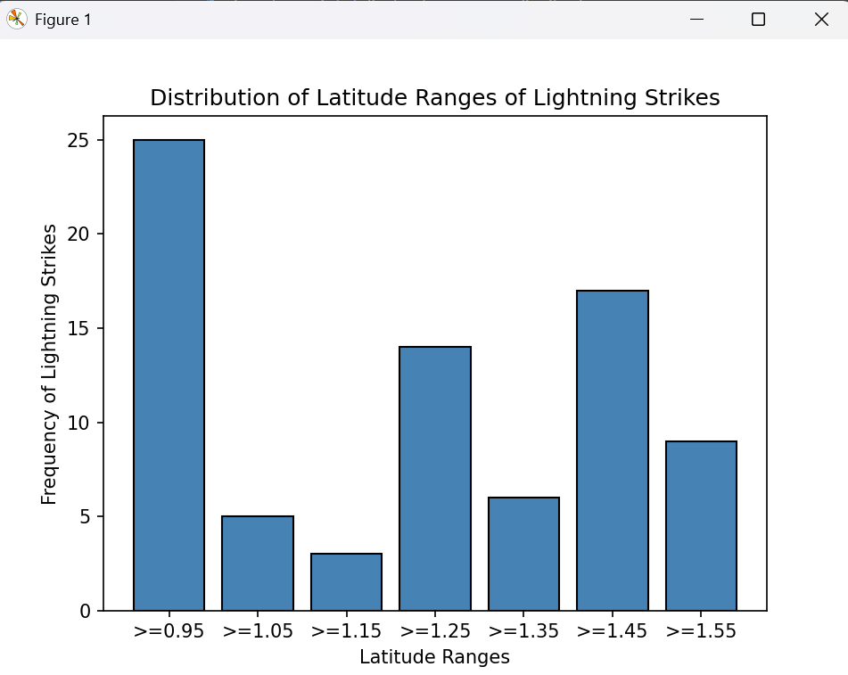
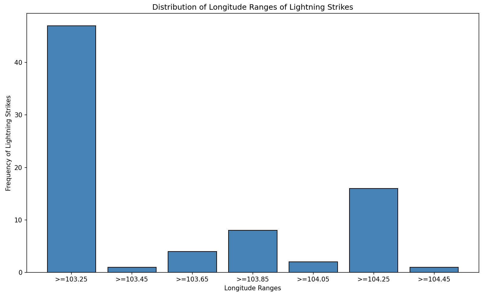

# Monte Carlo Lightning Strike Model
Estimating lightning strikes across a town, & optimising town layout to minimise damage to town assets.

**Critical Town Assets**
- Barn (B)
- Hospital (H)
- Apartment (A)
- Field (F)

Each **Asset** has:
1. X and Y coordinates (indicating location of asset)
2. Damage Threshold (1-5)
3. Repair Time (from lightning damage) (1-4)
4. Level of Importance (1-10)

Each **Lightning Strike** (LS) has:
1. Direct Strike Radius (1)
2. Indirect Strike Radius (1-2)
3. Strength of Lightning Strike (1-4)

In order for an **Asset** to be damaged:
- Direct / Indirect Strike of LS has to overlap with the corresponding (x, y) coordinates of the asset
- Extent of Damage = (1 if LS == Direct else 0.5) x (strength of LS)
- If Damage Threshold - Extent of Damage <= 0, asset is destroyed

## Simulation Details
For each run:
1. Generate Lightning Strike (based on probability distribution)
2. Apply Damage to Asset (D = Damage Threshold - Extent of Damage)

For each day:
1. Damaged Assets require corresponding "Repair Time" days to be restored
2. If Damaged Assets are striked again, their repair time restarts from 0 (assume destroyed again!)

# Objective
To extract optimal layout of town for minimal damage given thunderstorm.

# Project Aspects
### Simulation Building
**First Iteration**
Ideation and Construction of simple model to simulate thunderstorm over a town.
- `Town` and `Asset` Classes created
- `generate_lightning_strikes(town_size, expected_daily_lightning_stikes, no_of_days)` used to generate striking coordinates for each lightning strike for each day
- `lightning_simulation_sample(town_size, expected_daily_lightning_stikes, no_of_days)` runs a single simulation of a thunderstorm on a new instance of a Town of size `town_size`, that lasts for `no_of_days` days
- `run_simulations(num_simulations, town_size, expected_daily_lightning_stikes, no_of_days)` notes down the experiment parameters (`eid, town_size, expected_daily_lightning_strikes, no_of_days`), and performs `num_simulations` number of independent simulations based on the given parameters, saving all relevant data into a local database

### Data Collection
**First Iteration**
**Database Schema**
1. **ExperimentParams**(eid, town_size, exp_daily_lightning, max_days)
  - notes down the parameters of a given set of Samples (i.e. town size, expected number of lightning strikes per day, and the max days the lightning storm goes on for)
2. **Samples**(id, eid, survived, total_days, survival_day, total_assets, num_of_destroyed)
  - represents the results collected from one sample. One sample involves putting the town (of size `town_size`) under a simulated thunderstorm the goes on for `max_days` days, where each day, the number of lightning strikes follows a probability distribution of Poisson(`exp_daily_lightning`)
  - Striking coordinates of lightning strikes follow a uniform distribution (town is assumed to be level)
  - Each sample consists of 2 instances of ALL asset types (total 8 different buildings), located in fixed and constant positions across ALL samples
3. **Assets**(sid, atype, a_row, a_col, destroyed)
  - contains information about the various assets in each sample, including type, location, and if they were destroyed (NOT DAMAGED) at the end of each run.
4. **LightningStrikes**(sid, day, num_of_strikes)
  - contains information on the number of lightning strikes in a certain day for a given sample
With every run of `run_simluations()`,
- 1 `ExperimentParams` tuple is added (if it did not already exists)
- 1 `Samples` tuple is added
- n `Assets` tuples are added (depends on the number of assets in that town for each sample run - for now it is fixed at `8`)
- m `LightningStrikes` tuples are added (depends on the number of lightning strikes generated each day + the total number of days for each sample run)

### Data Analysis
**First Iteration**
Analysed various metrics based on a **single, fixed** layout of the town. The metrics include:
- Survival rate of the town across all samples
- Probability distribution of destruction of the town across the days of the thunderstorm
- Which Assets are most easily left destroyed at the end of each thunderstorm
- Probability Distribution of the loss of assets (weighed by summation of the `importance` of each asset) across the days of the thunderstorm

### Refining the Simulation
**First Iteration**
Performed API calls to Data Gov SG's lightning strikes database to:
1. Observe if Lightning Strikes (Cloud-to-Ground) do indeed follow a Poisson Distribution for each day
  
  - The number of days where there was only 1 lightning strike is an outlier, and can be accounted for the fact that Singapore has small land mass, and thunderstorms with lightning that strike the land once may have other lightning strikes that strike offshore, and are hence not detected.
2. Observe if coordinates of Lightning Strikes do indeed follow a Uniform Distribution
  - Latitude Distribution 
  - Longitude Distribution 
3. Obtain a proper, realistic lambda value (expected number of lightning strikes each day)
  - `lambda` = 746 / 365 = **2**

### Limitations
1. Data obtained from https://data.gov.sg/datasets?query=lightning+strikes&resultId=d_08238953fe0f6dd13f10714ebfbcb9f9 begin only from Jan 2025, where many lightning strikes are 'Cloud-to-Cloud' and not 'Cloud-to-Ground' (Only 10.6% of 746 strikes are 'Cloud-to-Ground').